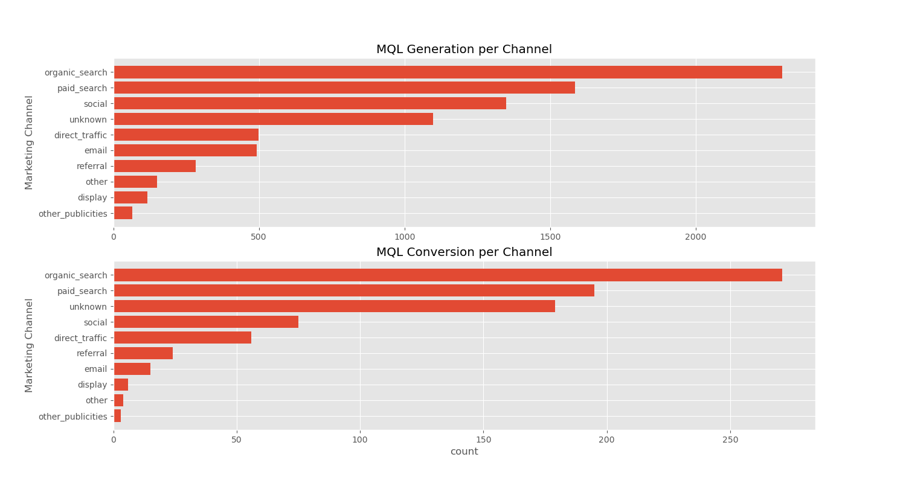
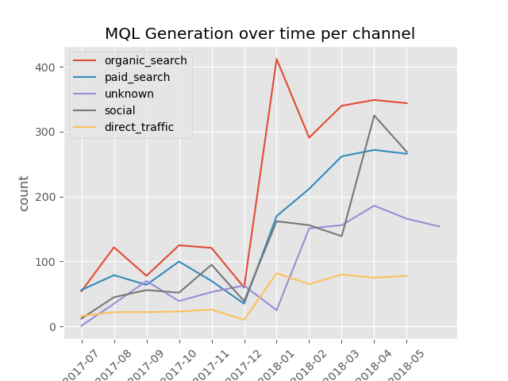
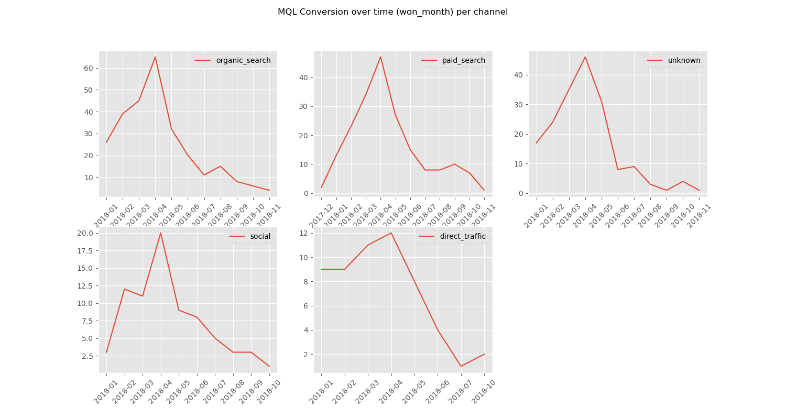
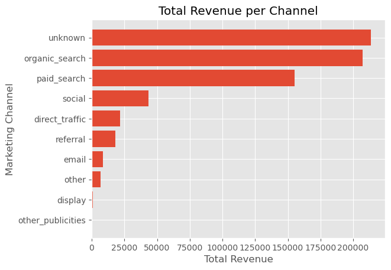
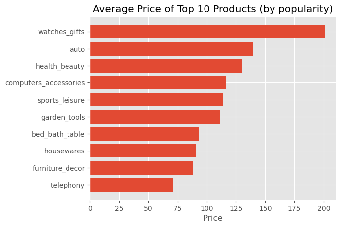
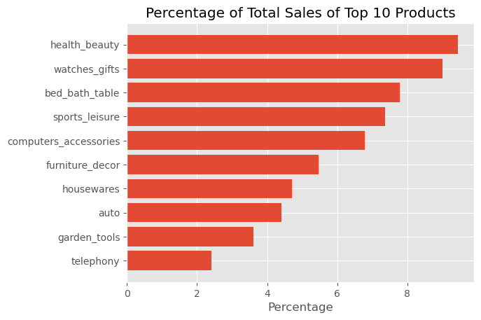
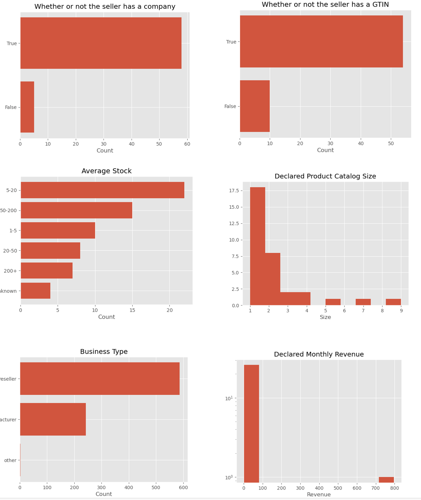
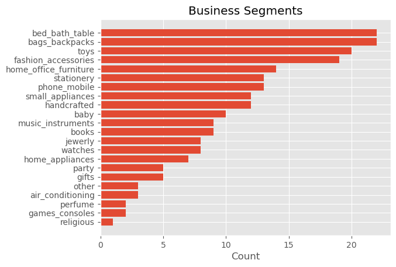
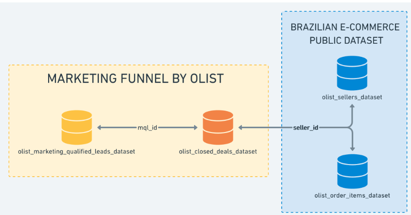

# Olist Analysis:

## About Olist
- Olist is an e-commerce marketplace integerator connecting small businesses from all over Brazil to different customers.
    - small business can sign up on Olist and have their products promoted on various platforms (e.g., amazon) 
    - small business can sell directly to the Olist store and ship them directly using Olist logistics partners
    - Olist also provides market intellgience (market tendencies, pricing tools, performance tools)

## Analysis Focus:
- My goal for this project was to analyze Olist in three domains:
    - Marketing Performance:
        - to generate metrics to evaluate different marketing strategies used to attract vendors onto Olist's platform. 
    - Sales Performance:
        - to explore customer preferences and product popularity
    - Vendor Profile
        - Olist has two business streamlines. The customers who buys products on the platform and the sellers who sign up on Olist to sell products on Olist's platform. I want to focus on the latter and generate insights on what kind of vendors sign up on Olist

## Marketing Performance:
- Analyzed data on Olist's marketing funnel to attract vendors to sign up and list their products on Olist's platform. Marketing Qualified Leads (MQL) are generated if vendors sign up on Olist's platform. MQLs are converted if the vendors decide to agreed to sell their products on Olist's platform
- Paid search and Organic Search were the most effective strategies(channels) in MQL generation and conversion

- MQL generation and conversion spiked after December 2017. The numbers of organic search spiked nearly 300% in the span of 1 month. This is partly due to Brazil's 13th salary policy, in which the government mandates company to give 1/12 of the employee's salary at the end of the year. 

- Looking at the total revenue produced per channel, organic and paid search are both at the top. 

- Overall, the end of the year is the prime time period to promote both paid searches and social media campaigns. This also means that marketing campaigns are inefficient in other parts of the year.
- However, the increases are so drastic that it is difficult to decide whether this generalizes to other years as well
 
## Sales Performance:
- Found the top 10 most popular products by counting all the products in order items and selecting the 10 most popular items.
- Cosmetics, gifts, and housing furniture contribute the most to sales
- The top 10 most popular products contribute to nearly 60% of total sales

- Overall, luxury and leisure products are the most popular. Focusing on promoting these products along with the other products in the top10 is the most effective strategy to increase sales

## Vendor Profile:
- The vendors, who join Olist, are small businesses that focus on reselling on smaller-sized products and lack logistic infrastructure
    - The low monthly revenue and stock prices indicate that these vendors are small-scaled
    - The lack of GTIN (Global Trade Item Number) suggest that these vendors don't have experience or a system to efficiently sell their items
- This vendor profiles matches with Olist's branding on their website

- Overall, Olist should focus continue providing the logistic and system support that these vendors lack

## Datasets:
- For this project, I used [marketing](https://www.kaggle.com/datasets/olistbr/marketing-funnel-olist) and [retail](https://www.kaggle.com/datasets/olistbr/brazilian-ecommerce) data provided by Olist on kaggle
- The retail data include 100K orders from 2016-2018. 
- The marketing data include 8K MQLS from 2017-2018.
- The data scheme:

## Code:
- The code for the EDA and data cleaning can be found under `/eda_cleaning`
- The code for all the analysis are in the current working directory of this file: `marketing_analysis.ipynb`, `sales_analysis.ipynb`, and `sellers_profile.ipynb`
- The datasets are under `/data`
- The datasets can be loaded in a database using the sql files under `/sql_files`
